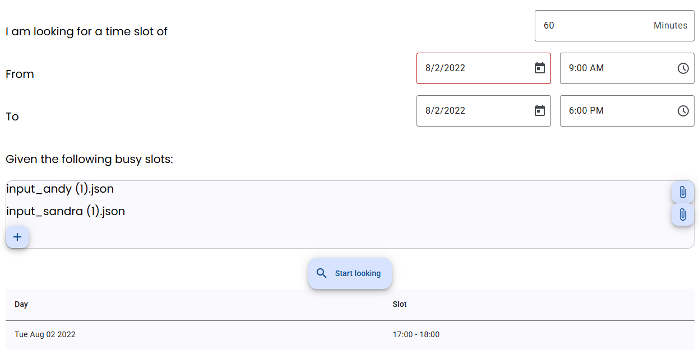

# Time slots management application

## 4 Hours checkpoint functionalities

### Backend

* Exposes a POST endpoint that calculates the available time slots given the following criteria
    * Duration of the time slot
    * Start period (date - time)
    * End period (date - time)
    * Time slots that are unavailable (busy)

* Validates the incoming POST request's payload.

* Ensures that given free time slots are in business hours.

* Take into consideration overlaping busy time slots.

### Frontend

Angular application that has a simple UI with a form to input the criteria and a table to display the results.

